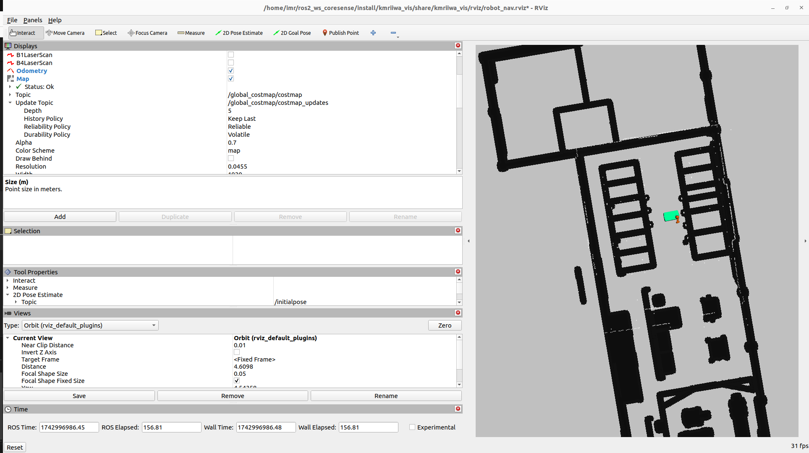

# KMRIIWA_ROS_STACK
This metapackage enables to use and control the KMRIIWA robot using ROS-BRIDGE to ROS2. It provides packages for robot's navigation, manipulation, visualisation and simulation. A brief description of thsee packages and a usage guide follows. 

**Note that this package depends on the [kmriiwa_ros_java driver](https://github.com/stoic-roboticist/kmriiwa_ros_java) to be running on the robot for its control.**

**This pakcage was tested on Ubuntu 22 with ROS HUMBLE**

## Description

### kmriiwa_navigation
This package allows to control the KMP200 base using the navigation stack. It utilises nav2 package for planning and control.

### kmriiwa_msgs
This package contains custom ros messages specific to the KMRIIWA robot that allows to convey its status similar to ROS1 message of the repo.

### kmriiwa_gazebo
This package allows to simulate the robot in Gazebo. It exposes the same interfaces as the robot driver and allows to control both the base and the arm.

### kmriiwa_vis
This package contain different rviz configs to visualise the robot in different contexts.


## Installation
To install this package, all its dependencies can be retrieved using rosdep except [ira_laser_tools](https://github.com/ryanpennings/ira_laser_tools) for Humble that needs to be added to your workspace. As a result, to successfully build this package follow these steps:
1. Navigate to the `src` directory of your ROS workspace (e.g. `cd ~/ros2_ws/src`)
2. Clone [ira_laser_tools](https://github.com/ryanpennings/ira_laser_tools):
```
git clone https://github.com/iralabdisco/ira_laser_tools
```
3. Run `cd ~/ros2_ws`

4. Run colcon build

## Usage

**To run this package, [kmriiwa_ros_java driver](https://github.com/stoic-roboticist/kmriiwa_ros_java) needs to be installed on the robot controller. Refer to that package README.md for setup and usage instructions.**

### Multi-robot support
The developed stack supports multi-robot applications out of the box and as a result all of its packages run inside a namespace by default. This behavior is controlled via the **use_namespace** and **robot_name** arguments accepted by all the relevent launch scripts. The used namespace is equivalent to the *robot_name* argument inside those launch scripts. If for some reason, you need to run these packages without namespace, set the argument **use_namespace** to false when starting the specific launch script (append **use_namespace:=false** to the specific roslaunch command). 

**Regardless of that, always make sure the *robot_name* argument is equivlent to the parameter *robot_name* set on the driver's application ProcessData running on the controller. If those are different, nothing will work**

### Static transform between odom, map and robot_base_footprint
Run this command before launching the navigation stack
```
ros2 run tf2_ros static_transform_publisher --x 0 --y 0 --z 0 --qx 0 --qy 0 --qz 0 --qw 1 --frame-id map --child-frame-id kmriiwa_odom & ros2 run tf2_ros static_transform_publisher --x 0 --y 0 --z 0 --qx 0 --qy 0 --qz 0 --qw 1 --frame-id kmriiwa_odom --child-frame-id kmriiwa_base_footprint
```
 
### navigation and manipulation planning stack
Launch the navigation node after sourcing the workspace, rviz file with all parameter visualization is launched:

```
ros2 launch kmriiwa_navigation kmr_robot_navigation.launch.py
```

Merge the laserscan into one merged scan using the followin launch file:

```
ros2 launch kmriiwa_navigation laserscan_merge.launch.py
```

Waypoint poses are being sent through the following file:

```
/ros2_ws/src/kmriiwa_ros_stack/kmriiwa_navigation/scripts$ python3 send_multiple_goals.py 
```

Map file used is under: 
```
cd kmriiwa_ros_stack/kmriiwa_navigation/maps/bay3_map.yaml
```

or play the rosbag file sent
```
ros2 bag play <bag>
```


### ARUCO Marker - Manipulator positioning
#### Realsense d435
```
ros2 launch realsense2_camera rs_launch.py 
```
#### For now run scripts
```
python3 aruco_detect_v2.py
```
#### Arm Control using KDL - Scripts
```
python3 kmriiwa_arm_kdl_control_test_case_with_aruco.py 
```
### Ensure map-server is installed
```
sudo apt-get install ros-$ROS2-DISTRO$-nav2-map-server
```

### For gazebo simulation launch the following:
#### 1. Launch Gazebo
```
ros2 launch kmriiwa_simulation gazebo_coresense.launch.py
```
#### 2. Launch the Navigation with Nav2
This is simlar to the actual navigation with the real-robot
```
ros2 launch kmriiwa_navigation kmr_robot_navigation.launch.py
```

#### 3. Merge laser data for localization and mapping
```
ros2 launch kmriiwa_navigation laserscan_merge.launch.py
```
##### Important please set the initial pose of the robot for AMCL
##### Note: Map is not perfect there are deviations in the current map, but the nav2 would work


#### 4. Remap velocity as gazebo takes cmd_vel as input
```
ros2 run topic_tools relay /kmriiwa/base/command/cmd_vel /cmd_vel
```
#### 5. Point to point navigation from different stations
```
cd kmriiwa_ros_stack/kmriiwa_navigation/scripts/
python3 send_multiple_goals_gazebo.py
```
